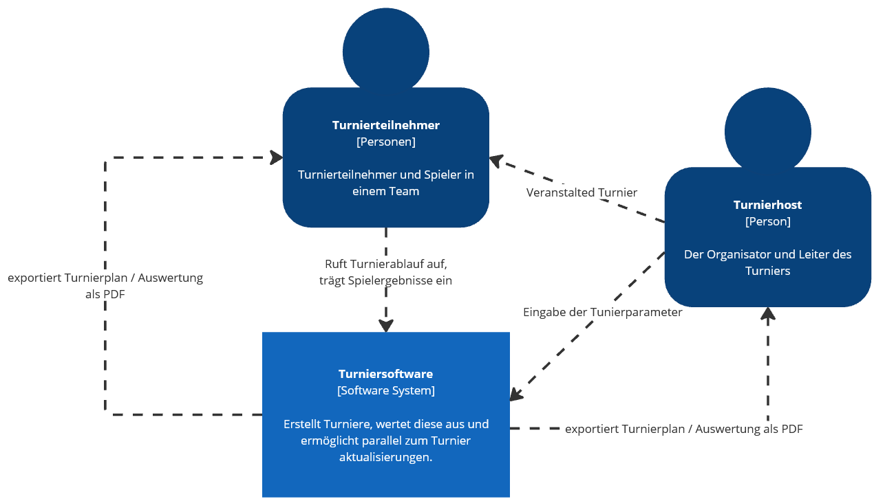
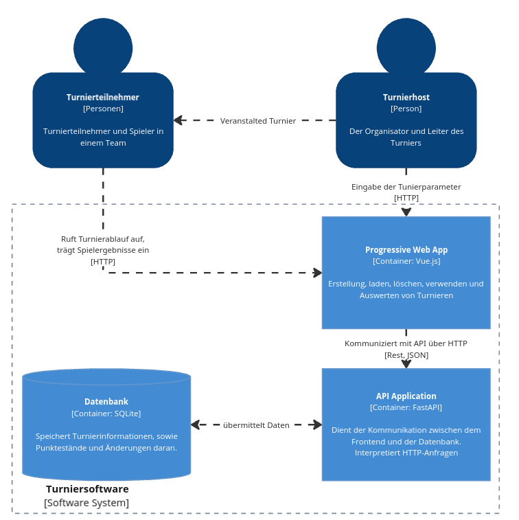

= Architecture Notebook: {project-name}
Sebastian Treß <s86372@htw-dresden.de>
{localdatetime}
:imagesdir:images/
include::../_includes/default-attributes.inc.adoc[]
// Platzhalter für weitere Dokumenten-Attribute

== Zweck
Dieses Dokument beschreibt die Philosophie, Entscheidungen, Nebenbedingungen, Begründungen, wesentliche Elemente und andere übergreifende Aspekte des Systems, die Einfluss auf Entwurf und Implementierung haben.

//Hinweise: Bearbeiten Sie immer die Abschnitte 2-6 dieser Vorlage. Nachfolgende Abschnitte sind empfohlen, aber optional und sollten je nach Umfang der künftigen Wartungsarbeiten, Fähigkeiten des Entwicklungsteams und Bedeutung anderer architektureller Belange.

//Anmerkung: Die Architektur legt wesentliche EINSCHRÄNKUNGEN für den Systementwurf fest und ist ein Schlüssel für die Erfüllung nicht-funktionaler Eigenschaften!

== Architekturziele und Philosophie
//Hinweise: Beschreiben Sie die Philosophie der Architektur, d.h. den zentralen Ansatz für ihre Architektur. Identifizieren Sie alle Aspekte, die die Philosophie beeinflussen, z.B. komplexe Auslieferung Aspekte, Anpassung von Altsystemen oder besondere Geschwindigkeitsanforderungen. Muss es besonders robust sein, um eine langfristige Wartung und Pflege zu ermöglichen?

//Formulieren Sie eine Reihe von Zielen, die die Architektur in ihrer Struktur und ihrem Verhalten erfüllen muss. Identifizieren Sie kritische Fragen, die von der Architektur adressiert werden müssen, z.B. besondere Hardware-Abhängigkeiten, die vom Rest des Systems isoliert werden sollten oder Sicherstellung der Funktionsfähigkeit unter besonderen Bedingungen (z.B. Offline-Nutzung).

Das System ist eine vollständige Turniersoftware, primär für den Sport Volleyball. Es soll die Organisation von Turnieren erleichtern, sowie die Durchführung und Auswertung von Spielen ermöglichen. Die Organisation soll mittels eines Turnierplangenerator erfolgen, der die Erstellung von Turnierplänen für unterschiedliche Anzahl an Spielfeldern Spielern und Leistungsgruppen ermöglicht. Die Turnierdurchführung soll durch die Erfassung von Spielergebnissen und die Einsicht von allen Teilnehmern ermöglicht werden. Die Auswertung soll die Ermittlung von Siegern und die Speicherung der Turnierergebnisse ermöglichen. Die Software soll offline und online nutzbar sein und auf unterschiedlichen Geräten und Betriebssystemen laufen. 

// - offline und online Nutzbar
// - einheitliche Syntax für Programmcode
// - übersichtliche Programmstruktur
// - keine besonderen Geschwindigkeitsanforderungen 
// - keine besonderen Sicherheitsanforderungen
// - Modularer Aufbau um eine leichte Weiterentwicklung zu ermöglichen
// - Datenspeicherung
// - exportieren von Dateien
// - soll für unterschiedlichen Betriebssystemen funktionieren 
// - soll für unterschiedlichen Gerätetypen funktionieren (z.B. Handy, Laptop, Tablet, ... )
// - Zugriff von mehreren Geräten soll möglich sein
// - Einfach Kompilieren/Testen

// - Erstellen von "Volleyball" Turnierplänen für den Stura 
// - Anzahl Spielfelder variable
// - Anzahl Spieler variable
// - Auswahl, ob es Hin- und Rückspiele gibt
// - muss offline funktionieren
// - soll auf jedem Gerät (z.B. Mobil, Computer, ... ) und Betriebssystem Laufen
// - Turnierpläne müssen exportierbar sein
// - erfassen der Spielergebnissen
// - Einsicht von allen Teilnehmern
// - Spielpläne individueller Teams sollen einsehbar sein
// - Pausen sollen bei den Teams gleichmäßig verteilt sein
// - Turnier soll auswertbar und speicherbar sein

== Annahmen und Abhängigkeiten
//[List the assumptions and dependencies that drive architectural decisions. This could include sensitive or critical areas, dependencies on legacy interfaces, the skill and experience of the team, the availability of important resources, and so forth]
Annahmen: +
Jeder Nutzer hat ein Gerät mit Internetzugang.
Jeder Nutzer benutzt einen HTML5 fähigen Browser und hat JavaScript aktiviert.
Der StuRa hat ein Zentrales Gerät, auf dem die Turnierapp installiert ist.
Dieses Gerät ist fähig ein mobiles Netzwerk aufzubauen.

Abhängigkeiten: +
Wir sind darauf angewiesen, dass alle eingesetzten Frameworks und Bibliotheken weiterhin unterstützt werden.

== Architektur-relevante Anforderungen
//Fügen Sie eine Referenz / Link zu den Anforderungen ein, die implementiert werden müssen, um die Architektur zu erzeugen.

- Informationsübertragung mit einen Datenspeicherung.
- 

== Entscheidungen, Nebenbedingungen und Begründungen
//[List the decisions that have been made regarding architectural approaches and the constraints being placed on the way that the developers build the system. These will serve as guidelines for defining architecturally significant parts of the system. Justify each decision or constraint so that developers understand the importance of building the system according to the context created by those decisions and constraints. This may include a list of DOs and DON’Ts to guide the developers in building the system.]
. Das Interface und Design ist von der HTW-Mobil App, sowie von dem StuRa farbschema inspiriert, um eine intuitive und
Ansprechende Oberfläche zu schaffen.

. Wir haben uns dazu entschieden die Turnierapp in Form einer Progressiven Web App umzusetzen, um die Nutzung auf den unterschiedlichsten Geräten, sowie die Funktionalität bei Verbindungsabbrüchen zu gewährleisten. Dazu haben wir uns für die Verwendung von Vue.js entschieden, da es eine einfache und effiziente Möglichkeit bietet, um Webanwendungen zu erstellen. Des Weiteren verwenden wir Nuxt.js, um die Entwicklung zu vereinfachen und die Performance zu steigern. Diese wird auf einem Gerät des StuRa gehostet, somit kann auch ohne ein Internetzugang am Turnierort mit einem mobilen Hotspot auf die App zugegriffen werden. Dadurch wird ebenfalls einem Zugriff auf ein Laufendes Turnier von außerhalb entgegengewirkt.

. Um die unterschiedlichen Turniere zu Speicherung und abrufbar zu machen haben wir uns dafür entschieden die Daten der Turniere in einer Datenbank unter Verwendung von SQLight zu Speichern. Dies ermöglicht eine effiziente und zentrale Speicherung der Spieldaten, sowie die Möglichkeit der Skalierung z.B. durch Migiration auf PostgreSQL.
Da SQLight kein dedizierten Datenbankserver benötigt, wird das System zunächst auf dem Gerät des StuRa installiert und kann von dort aus genutzt werden. Es besteht dennoch die Möglichkeit, das System auf einem Server zu installieren und damit eine zentrale Speicherung der Daten zu ermöglichen.

. Um einen einfachen zugriff auf die Datenbank zu besitzen, haben wir uns dafür entschieden eine FastAPI zu verwenden.

. Wir haben unseren Fokus für die Auswahl der Technologien auf die kompabilität mit Python gelegt, um einen möglichst einfachen und konsistenten Syntax und Code zu gewährleisten.

== Architekturmechanismen
https://www2.htw-dresden.de/~anke/openup/core.tech.common.extend_supp/guidances/concepts/arch_mechanism_2932DFB6.html[Doku "Concept: Architectural Mechanism"]
//[List the architectural mechanisms and describe the current state of each one. Initially, each mechanism may be only name and a brief description. They will evolve until the mechanism is a collaboration or pattern that can be directly applied to some aspect of the design.]

//Beispiele: relationales DBMS, Messaging-Dienste, Transaktionsserver, Webserver, Publish-Subscribe Mechanismus

//Beschreiben Sie den Zweck, Eigenschaften und Funktion der Architekturmechanismen.

. Komponenten verwenden
. leserlichen Code schreiben
. standardisierten Syntax

== Wesentliche Abstraktionen
//[List and briefly describe the key abstractions of the system. This should be a relatively short list of the critical concepts that define the system. The key abstractions will usually translate to the initial analysis classes and important patterns.]

== Schichten oder Architektur-Framework
//[Describe the architectural pattern that you will use or how the architecture will be consistent and uniform. This could be a simple reference to an existing or well-known architectural pattern, such as the Layer framework, a reference to a high-level model of the framework, or a description of how the major system components should be put together.]
- FastAPI (Python)
- SQLite (SQL)
- Vue (Java Script)

== Architektursichten (Views)
//[Describe the architectural views that you will use to describe the software architecture. This illustrates the different perspectives that you will make available to review and to document architectural decisions.]

Folgende Sichten werden empfohlen:

=== Logische Sicht
//Beschreibt die Struktur und das Verhalten Systemteilen, die hohen Einfluss auf die Architektur haben. Dies kann die Paketstruktur, kritische Schnittstellen, wichtige Klassen und Subsysteme sowie die Beziehungen zwischen diesen Elementen enthalten. Zudem sollten die physische und logische Sicht persistenter Daten beschrieben werden, wenn es diesen Aspekt im System gibt. Dies ist ein hier dokumentierter Teilaspekt des Entwurfs.

Layer 1:

Layer 2:

=== Physische Sicht (Betriebssicht)
//Beschreibt die physischen Knoten (Rechner) des Systems, der Prozesse, Threads und Komponenten, die in diesen Knoten ausgeführt werden. Diese Sicht wird nicht benötigt, wenn das System in einem einzelnen Prozess oder Thread ausgeführt wird.

=== Use cases
//Eine Liste oder ein Diagramm der Use Cases, die architektur-relevante Anforderungne enthalten.
