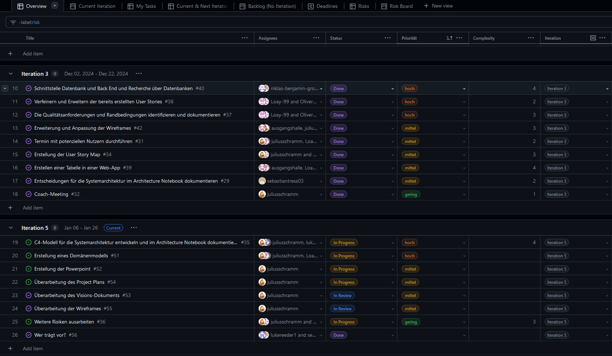
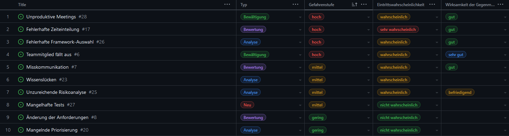
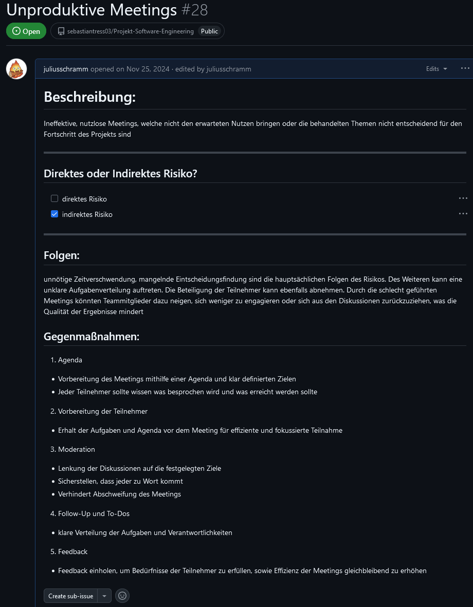

= Projektplan: {project-name}
Julius Schramm <julius.schramm@stud.htw-dresden.de>; Oliver Theumer <s86407@htw-dresden.de>
{localdatetime}
// Meta
:project-name: Turnierorganisationssoftware
:project-system-name: Turnierorganisationssoftware
// Settings:
:toc:
:toc-title: Inhaltsverzeichnis
:toclevels: 2
:sectnums:
:icons: font
//:source-highlighter: highlightjs
:source-highlighter: rouge
:rouge-style: github
:xrefstyle: full
:figure-caption: Abbildung
:table-caption: Tabelle
:!example-caption:
:experimental:
// folder
ifndef::diagramsdir[:diagramsdir: diagrams]
ifndef::plantumlsdir[:plantumlsdir: plantuml]
// Hyphenation for PDF dokumente
:lang: DE
:hyphens:
// main document
:main-document:
// Platzhalter für weitere Dokumenten-Attribute

== Einführung
//Briefly describe the content of the project plan.
In diesem Dokument wird der Projektplan für das Projekt {project-name} vorgestellt. Der Projektplan beschreibt die Ziele, den Umfang, die Organisation, die Praktiken und Bewertungen, die Meilensteine und Ziele, das Deployment und die Erkenntnisse des Projekts.

Die generelle Projektorganisation fand hauptsächlich auf https://github.com/users/sebastiantress03/projects/6[Github Projects] statt. Dort sind auch die Risikoliste, sowie die Issues und User Stories zu finden.

== Projektorganisation
//Introduce the project team, team members, and roles that they play during this project. If applicable, introduce work areas, domains, or technical work packages that are assigned to team members. Introduce neighboring projects, relationships, and communication channels. If the project is introduced somewhere else, reference that location with a link.
=== Projektteam

|===
| *Name* | *Rolle* | *Kontakt* | *Studiengang*
| Sebastian Treß | Architekt| s86372@htw-dresden.de | Informatik
| Niklas Große |Programmierer | s86379@htw-dresden.de | Informatik
| Louai Alrefai | Analyst | s85081@htw-dresden.de | Wirtschaftsinformatik
| Luke Reeder | Tester | s85591@htw-dresden.de | Wirtschaftsinformatik
| Thomas Sweeney | Programmierer, Analyst | s86208@htw-dresden.de  | Wirtschaftsinformatik
| Oliver Theumer | Analyst, stellvertr. Projektleiter | s86407@htw-dresden.de| Wirtschaftsinformatik
| Julius Schramm | Projektleiter | s85699@htw-dresden.de | Wirtschaftsingeneurwesen
|===

=== Kommunikationswege

Die *zentrale Kommunikation* erfolgt über Discord.

Die *Dokumentation* wird in einem Git-Repository auf GitHub gepflegt.

Die *Aufgabenverwaltung* erfolgt über GitHub Projects. 

== Praktiken und Bewertung
//Describe or reference which management and technical practices will be used in the project, such as iterative development, continuous integration, independent testing and list any changes or particular configuration to the project. Specify how you will track progress in each practice. As an example, for iterative development the team may decide to use iteration assessments and iteration burndown reports and collect metrics such as velocity (completed work item points/ iteration).

=== Iterative Entwicklung

In diesem Projekt wird eine iterative Entwicklung angestrebt, um regelmäßig Feedback zu erhalten und die Anforderungen der Stakeholder an das Projekt zu überprüfen.

Die Entwicklung erfolgt in dreiwöchigen Iterationen, mit jeweils einem Team-Meeting pro Woche und einem Coach- als auch Auftraggeber-Meeting pro Iteration.
Am Anfang einer Iteration bespricht das Project Management die Hinweise des Professors und fertigt in Folge dessen eine Liste an Issues an, die in der Iteration bearbeitet werden sollen. Diese Issues werden dann in GitHub Projects eingetragen. Die Zuweisung der Aufgaben erfolgt im ersten Meeting der Iteration. Dabei wird darauf geachtet, dass die Issues als User Stories mit Definition of Done, Akzeptanzkriterien und Schätzungen versehen sind, um eine leichtere Handhabung für die Teammitglieder zu gewährleisten.

==== GitHub Projects

Das GitHub Project hat folgende Views:

- Overview: Hier werden alle Issues angezeigt
- Current Iteration: Hier werden alle Issues angezeigt, die in der aktuellen Iteration bearbeitet werden sollen
- My Tasks: Hier werden alle Issues angezeigt, die dem jeweiligen Teammitglied zugewiesen sind
- Current & Next Iteration: Hier werden alle Issues angezeigt, die in der aktuellen und der nächsten Iteration bearbeitet werden sollen
- Backlog: Hier werden alle Issues angezeigt, die keiner Iteration zugewiesen wurden
- Deadlines: Hier werden alle Issues, sowie ihre Deadlines angezeigt

Außerdem helfen Fields, wie beispielsweise Status (To Do, In Progress, In Review, Done) und Priorität (Gering, Mittel, Hoch, Kritisch) dabei, den Überblick über die Issues zu behalten.

Darüber hinaus gibt es noch die Möglichkeit, Labels zu verwenden, um die Issues zu kategorisieren. Beispielsweise können Labels wie "Bug", "Feature", "Enhancement" oder "Documentation" verwendet werden.

.Beispielausschnitt einer Iteration im GitHub Projects

Die Risikoanalyse wird ebenfalls im Project Board abgebildet. Hierfür gibt es folgende Views:
- Risks: Hier werden alle Risiken angezeigt, die im Projekt auftreten können
- Risk Board: Hier werden die Risiken mit ihrem Status (Neu, Analyse, Bewertung und Bewältigung) angezeigt

.Überblick der Risikoliste

.Detaillierte Ansicht eines Risikos

=== Fortschrittskontrollen

Eine Fortschrittskontrolle wird mithilfe von Review Sessions innerhalb der Iterationen und mittels Retrospektiven am Ende der Iterationen durchgeführt. Diese sollen dafür sorgen, dass das Projektteam stets auf dem aktuellen Stand ist und auch im Krankheitsfall eines Teammitglieds die Arbeit fortgeführt werden kann. Außerdem wird damit sichergestellt, dass die Anforderungen an die jeweiligen Aufgaben erfüllt sind.
Außerdem wird mithilfe der Retrospektiven gewährleistet, dass die Effizienz, Zusammenarbeit und Effektivität des Teams stetig verbessert wird.

== Meilensteine und Ziele
//Define and describe the high-level objectives for the iterations and define milestones. For example, use the following table to lay out the schedule. If needed you may group the iterations into phases and use a separate table for each phase

[%header, cols="1,3a,2", align="center"]
|===
| Iteration
| Primary objectives
| Scheduled start or milestone

| I1
| * Teammitglieder kennenlernen
    * Förderung der Zusammenarbeit durch eine Etablierung von klaren und zentralen Kommunikationswegen

| 21/10/2024 - 10/11/2024

| I2
| * Anforderungen des Kunden verstehen, desses Analyse anfangen
    * Ausarbeitung der Vision und der Personas
    * Erstes Konzept für die Wireframes ausarbeiten
| 11/11/2024 - 01/12/2025

| I3
| * Anforderungensanalyse vertiefen
    * Identifikation der wichtigsten User Stories und Verfeinerung dieser
    * User Story Map
    * Erste Idee für den Prototypen entwickeln
| 02/12/2024 - 22/12/2024

| I4
| * Idee des Prototypen umsetzen und diesen fertigstellen
    * Prototypen für die Vorstellung vorbereiten
    * Präsentation vorbereiten
    * Belegdokumente überarbeiten und fertigstellen
| 06/01/2025 - 26/01/2025
|===

== Deployment
//Outline the strategy for deploying the software (and its updates) into the production environment.

== Erkenntnisse / Retrospektive (Lessons learned)
//List lessons learned from the retrospective, with special emphasis on actions to be taken to improve, for example: the development environment, the process, or team collaboration.

Nutzung von Story Points, Burn-Up Diagrammen und Iterationszielen mehr in den Fokus rücken, um die Effizienz und Effektivität des Teams zu steigern.

Am Anfang meetings schon klar strukturieren und plan vorgeben --> jeder kann sich gleich daran gewöhnen und mit dran teilnehmen
