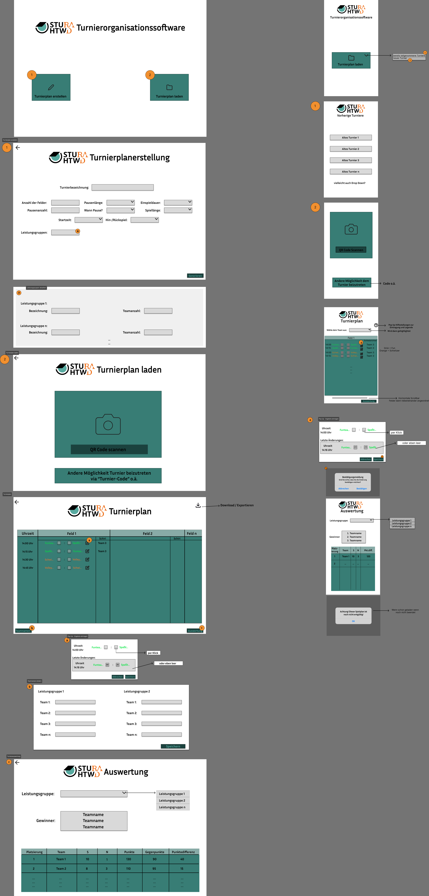

= UX-Concept: {project-name}
Julius Schramm <julius.schramm@stud.htw-dresden.de>
{localdatetime}
include::../_includes/default-attributes.inc.adoc[]

== Einführung
In diesem Dokument wird das UX-Konzept für das Projekt "{project-name}" vorgestellt. Das UX-Konzept beschreibt die Benutzeroberfläche der Software und die Interaktion der Benutzer mit dieser.

== Wireframe-Modell
Das https://www.figma.com/design/vGZx4tiIYAEevqN5n978A7/Wireframe-Modell-v2?node-id=601-9[Wireframe-Modell] wurde in Figma erstellt und dient als Grundlage für die Umsetzung der Benutzeroberfläche.

Falls der Link zu dem aktuellen https://www.figma.com/design/vGZx4tiIYAEevqN5n978A7/Wireframe-Modell-v2?node-id=601-9[Wireframe-Modell] nicht funktionieren sollte, ist dies unten zu finden. (Stand: 21.01.2025):

.Wireframe
